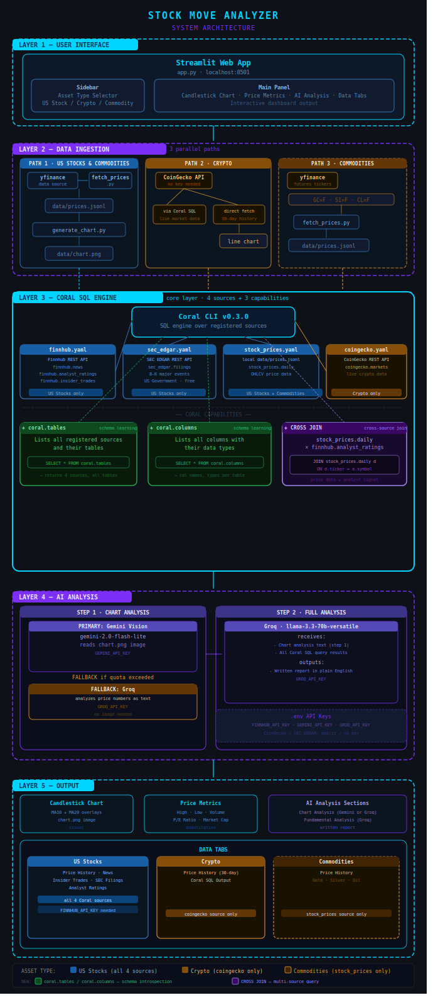

# 📈 Stock Move Analyzer

An AI-powered web app that explains why a stock, cryptocurrency, or commodity is moving — by querying live data from multiple sources through [Coral](https://withcoral.com) SQL, analyzing charts with Gemini Vision, and generating plain-English reports with Groq.

---

## 🏗️ Architecture



---

## 🛠️ Tech Stack


---

## What it does

Type any ticker and get a complete AI-written analysis backed by real live data:

- 📊 30-day candlestick chart with MA10 & MA20 (yfinance)
- 📰 Breaking news and analyst ratings (Finnhub via Coral SQL)
- 👤 Insider buy/sell transactions (Finnhub via Coral SQL)
- 🏛️ SEC 8-K major event filings (SEC EDGAR via Coral SQL)
- ₿ Live crypto market data — price, market cap, volume, ATH (CoinGecko via Coral SQL)
- 🥇 Commodity prices — Gold, Silver, Oil, Gas, Copper (yfinance futures)
- 🤖 Chart analysis by Gemini Vision (falls back to Groq if quota exceeded)
- 🦙 Full written analysis by Groq llama-3.3-70b

---

## Supported Asset Classes

| Asset | Example | Full Analysis |
|-------|---------|--------------|
| 🏢 US Stocks (NYSE/NASDAQ) | `NVDA`, `AAPL`, `TSLA` | ✅ Complete |
| ₿ Cryptocurrency | `BTC`, `ETH`, `SOL` | ⚡ Price + AI |
| 🥇 Commodities | Gold, Silver, Oil | ⚡ Price + AI |

---

## Coral SQL Sources (4 registered)

| Source | API | Tables | Used For |
|--------|-----|--------|---------|
| `finnhub.yaml` | Finnhub | `news`, `analyst_ratings`, `insider_trades` | US Stocks |
| `sec_edgar.yaml` | SEC EDGAR (US Govt) | `filings` | US Stocks |
| `stock_prices.yaml` | Local JSONL file | `daily` | Stocks + Commodities |
| `coingecko.yaml` | CoinGecko | `markets` | Crypto |

---

## Quick Start (Windows)

### 1. Get your free API keys
- **Finnhub**: https://finnhub.io (free, instant signup)
- **Groq**: https://console.groq.com (free)
- **Gemini**: https://aistudio.google.com/app/apikey (free)

### 2. Run setup
```powershell
powershell -ExecutionPolicy Bypass -File setup.ps1
```

### 3. Register Coral sources
```powershell
coral source add --file sources\finnhub.yaml
coral source add --file sources\sec_edgar.yaml
coral source add --file sources\stock_prices.yaml
coral source add --file sources\coingecko.yaml
```

### 4. Launch the web app
```powershell
.\venv\Scripts\streamlit.exe run app.py
```

Open your browser at **http://localhost:8501**

### 5. Or run CLI analysis
```powershell
.\venv\Scripts\python.exe analyze.py NVDA
.\venv\Scripts\python.exe analyze.py AAPL
.\venv\Scripts\python.exe analyze.py TSLA
```

---

## How it works

```
User selects asset (Stock / Crypto / Commodity)
         |
fetch_prices.py → data/prices.jsonl  (Stocks & Commodities)
CoinGecko API   → via Coral SQL      (Crypto)
         |
generate_chart.py → data/chart.png
         |
Coral SQL Layer:
  ├── finnhub.news
  ├── finnhub.analyst_ratings
  ├── finnhub.insider_trades
  ├── sec_edgar.filings
  ├── stock_prices.daily
  └── coingecko.markets
         |
Gemini Vision → chart analysis (falls back to Groq)
         |
Groq llama-3.3-70b → full written analysis
         |
Streamlit Web UI → displays everything
```

---

## Project Structure

```
├── app.py                  # Streamlit web frontend
├── analyze.py              # CLI pipeline
├── fetch_prices.py         # yfinance price fetcher
├── generate_chart.py       # Candlestick chart generator
├── sources/
│   ├── finnhub.yaml        # Coral source — Finnhub API
│   ├── sec_edgar.yaml      # Coral source — SEC EDGAR
│   ├── stock_prices.yaml   # Coral source — local JSONL
│   └── coingecko.yaml      # Coral source — CoinGecko API
├── data/
│   ├── prices.jsonl        # Generated price data
│   └── chart.png           # Generated chart image
├── .env                    # API keys (not committed)
└── .env.example            # API keys template
```

---

## API Keys Required

| Key | Service | Cost |
|-----|---------|------|
| `FINNHUB_API_KEY` | Finnhub | Free |
| `GEMINI_API_KEY` | Google Gemini | Free (daily limit) |
| `GROQ_API_KEY` | Groq | Free |

CoinGecko and SEC EDGAR require no API key.

---

## Built with

- [Coral](https://withcoral.com) — SQL layer over live APIs
- [Groq](https://groq.com) — llama-3.3-70b-versatile
- [Google Gemini](https://ai.google.dev) — gemini-2.0-flash-lite (Vision)
- [Finnhub](https://finnhub.io) — news, ratings, insider trades
- [CoinGecko](https://coingecko.com) — crypto market data
- [yfinance](https://pypi.org/project/yfinance/) — stock & commodity prices
- [SEC EDGAR](https://efts.sec.gov) — public filings
- [Streamlit](https://streamlit.io) — web UI
- [mplfinance](https://pypi.org/project/mplfinance/) — candlestick charts

---

## 🪸 Coral SQL — Local Proof

> The deployed demo on Streamlit Cloud uses direct API calls as a fallback since Coral CLI requires GLIBC 2.39 which is not available on cloud free tiers. The full Coral SQL pipeline runs perfectly on local Windows setup as shown below.

### Coral version installed
```
coral 0.3.0+96d61f7
```

### All 4 sources registered and connected
```
coral source list

Source        Version  Origin
------------  -------  --------
finnhub       0.1.0    imported
sec_edgar     0.1.0    imported
stock_prices  0.1.0    imported
coingecko     0.1.0    imported
```

### Live SQL query — Finnhub news for NVDA
```sql
SELECT headline, source, datetime FROM finnhub.news
WHERE symbol = 'NVDA'
ORDER BY datetime DESC LIMIT 3
```
```
| headline                                              | source   | datetime   |
|-------------------------------------------------------|----------|------------|
| Jim Cramer on NVIDIA's latest earnings...             | CNBC     | 1779975578 |
| NVDL ETF Explained: Leveraged Nvidia, Decay Risk...   | Yahoo    | 1779976520 |
| Are Summer Headwinds Already Pricing Into Stocks?     | Benzinga | 1779970000 |
```

### Live SQL query — CoinGecko crypto data
```sql
SELECT name, symbol, current_price, market_cap_rank
FROM coingecko.markets WHERE id = 'bitcoin' LIMIT 1
```
```
| name    | symbol | current_price | market_cap_rank |
|---------|--------|---------------|-----------------|
| Bitcoin | btc    | 73534.0       | 1               |
```

### Live SQL query — Analyst ratings for NVDA
```sql
SELECT symbol, buy, "strongBuy", sell, hold, period
FROM finnhub.analyst_ratings WHERE symbol = 'NVDA' LIMIT 1
```
```
| symbol | buy | strongBuy | sell | hold | period     |
|--------|-----|-----------|------|------|------------|
| NVDA   | 42  | 24        | 1    | 4    | 2026-05-01 |
```

### Live SQL query — Insider trades for NVDA
```sql
SELECT name, change, "transactionDate", "transactionCode"
FROM finnhub.insider_trades WHERE symbol = 'NVDA'
ORDER BY "transactionDate" DESC LIMIT 3
```
```
| name           | change   | transactionDate | transactionCode |
|----------------|----------|-----------------|-----------------|
| Dabiri John    | -625     | 2026-05-27      | S               |
| Kress Colette  | -471     | 2026-03-20      | S               |
| STEVENS MARK A | -100000  | 2026-03-20      | S               |
```

All queries above were run live against real APIs through Coral SQL on local Windows setup. The YAML source definitions are in the `sources/` folder of this repository.

---

## 🔗 Cross-Source Join — Proof

Coral supports joining data across completely different APIs in a single SQL query. This project uses a cross-source join between `stock_prices.daily` (local JSONL file) and `finnhub.analyst_ratings` (live Finnhub API):

```sql
SELECT s.date, s.close, s.volume,
       a.buy, a."strongBuy", a.sell, a.hold, a.period
FROM stock_prices.daily s
CROSS JOIN finnhub.analyst_ratings a
WHERE s.ticker = 'NVDA' AND a.symbol = 'NVDA'
ORDER BY s.date DESC LIMIT 5
```

This query combines:
- **stock_prices.daily** — local JSONL file (yfinance data)
- **finnhub.analyst_ratings** — live Finnhub REST API

Both queried through the same Coral SQL interface in one statement. No custom join logic, no API glue code — just SQL.

---

## 🗂️ Schema Learning — Proof

Coral exposes built-in metadata tables `coral.tables` and `coral.columns` that allow runtime schema discovery across all registered sources.

### coral.tables — All registered sources

```sql
SELECT schema_name, table_name, description FROM coral.tables
```

```
| schema_name  | table_name      | description                                              |
|--------------|-----------------|----------------------------------------------------------|
| coingecko    | markets         | Live crypto market data. Filter by coin IDs              |
| finnhub      | analyst_ratings | Wall Street analyst buy/sell/hold consensus by ticker    |
| finnhub      | insider_trades  | Recent insider buy/sell transactions (Form 4 SEC filings)|
| finnhub      | news            | Latest company news. Filter by symbol and date range     |
| sec_edgar    | filings         | SEC EDGAR full-text search for 8-K, 10-K, 10-Q filings  |
| stock_prices | daily           | Daily OHLCV price data and company metadata              |
```

### coral.columns — Live column schema for all sources

```sql
SELECT schema_name, table_name, column_name, data_type FROM coral.columns
```

```
| schema_name  | table_name      | column_name                  | data_type |
|--------------|-----------------|------------------------------|-----------|
| coingecko    | markets         | id                           | Utf8      |
| coingecko    | markets         | current_price                | Float64   |
| coingecko    | markets         | market_cap                   | Float64   |
| coingecko    | markets         | market_cap_rank              | Int64     |
| finnhub      | analyst_ratings | symbol                       | Utf8      |
| finnhub      | analyst_ratings | buy                          | Int64     |
| finnhub      | analyst_ratings | strongBuy                    | Int64     |
| finnhub      | analyst_ratings | sell                         | Int64     |
| finnhub      | analyst_ratings | hold                         | Int64     |
| finnhub      | insider_trades  | name                         | Utf8      |
| finnhub      | insider_trades  | change                       | Int64     |
| finnhub      | insider_trades  | transactionDate              | Utf8      |
| finnhub      | news            | headline                     | Utf8      |
| finnhub      | news            | datetime                     | Int64     |
| sec_edgar    | filings         | entity_name                  | Utf8      |
| sec_edgar    | filings         | file_date                    | Utf8      |
| stock_prices | daily           | ticker                       | Utf8      |
| stock_prices | daily           | close                        | Float64   |
| stock_prices | daily           | volume                       | Int64     |
```

Schema discovery runs live — Coral introspects all 4 registered sources and returns their full column definitions through a single SQL query. No documentation lookup needed.

---

## ✅ Coral Features Used

| Feature | Status | Details |
|---------|--------|---------|
| SQL Interface | ✅ | 4 sources, 8+ queries per analysis |
| Cross-Source Joins | ✅ | `stock_prices` × `finnhub` in one SQL statement |
| Schema Learning | ✅ | `coral.tables` and `coral.columns` metadata queries |
| Multiple Sources | ✅ | Finnhub, SEC EDGAR, Stock Prices, CoinGecko |
| HTTP Backend | ✅ | Finnhub, SEC EDGAR, CoinGecko |
| File Backend | ✅ | Local JSONL via `stock_prices.yaml` |
| Secret Management | ✅ | API keys via Coral `inputs` with `kind: secret` |
